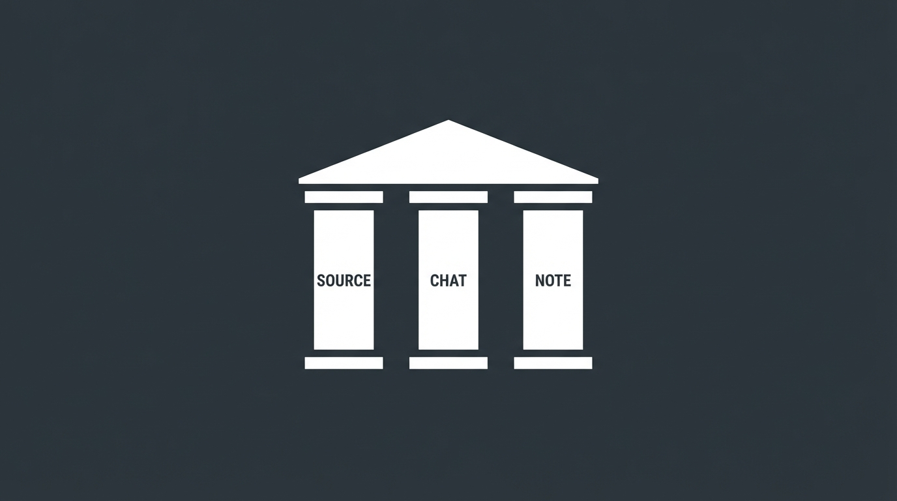

NotebookLMを使っていると、たくさんのボタンや機能が目に入ります。「これ全部使わないといけないのかな？」「どれが勉強に役立つのかな？」と迷ったことはありませんか？

結論から言うと、**機能の9割は無視してOKです。**

特に、ITパスポートや応用情報技術者試験のような「正確な知識」が求められる学習において、すべての機能が役立つわけではありません。中には、**かえって時間の無駄（ノイズ）になる機能** も存在します。

この記事では、現役エンジニアである筆者が、NotebookLMの全機能を **「学習に使えるか否か」** でS・B・Cの3段階に冷徹にランク付けしました。

## 【Sランク】学習に必須レベルな三種の神器

地味に見えますが、以下の3つこそがNotebookLMの本質であり、最強の機能です。

### 1. インライン引用（[1], [2]...の番号）

*   **評価** : **最強**
*   **理由** : AIの回答が正しいか、即座に裏取り（ファクトチェック）できるからです。
*   **活用法** :
    AIの解説を読んでいて「本当かな？」と思ったら、番号をクリック。すると、アップロードした教科書の該当箇所がハイライトされます。
    周辺の文脈も確認できるため、 **「ハルシネーション（AIの嘘）」対策** として不可欠です。

### 2. メモの保存（ピン留め）

*   **評価** : **極めて優秀** 
*   **理由** : 良い回答を一瞬でストックできるからです。
*   **活用法** :
    チャットで分かりやすい解説が出たら、すぐに「メモとして保存」。
    溜まったメモを選択して「これらをまとめて要約記事を作って」と指示すれば、 **学習ログがあっという間に「自分専用の参考書」や「ブログの下書き」** に変わります。

### 3. チャット（ただしプロンプトありき）

*   **評価** : **本質** 
*   **理由** : 結局、テキストでの対話が最も情報密度が高いからです。
*   **活用法** :
    「小学生にもわかるように例えて」「コードブロックで比較表を出して」などの具体的な指示（プロンプト）を出すことで、あなたの理解度に合わせた解説を引き出せます。

## 【Bランク】条件付きで使える（工夫が必要）

使うシーンを選べば強力な武器になります。

### 4. 音声解説（Audio Overview）

*   **評価** : **「ながら学習」限定** 
*   **注意点** : 机に向かって聞くには情報密度が低すぎます。移動中や単純作業中の **「耳のスキマ時間」を埋める用途** に絞って使いましょう。

### 5. 学習ガイド（クイズ生成）

*   **評価** : **「きっかけ作り」限定**
*   **注意点** : ボタン一つで作れるクイズは単純すぎます。本格的な演習をするなら、チャット機能で「もっと難しく」「ひっかけ問題を出して」と指示する必要があります。

## 【Cランク】学習には向いていない（時間の無駄）

ここが本題です。これらは「凄そうに見える」だけで、学習目的にはノイズになる可能性が高い機能です。

### 6. 推奨される質問（Suggested Questions）

*   **評価** : **不要（ノイズ）**
*   **解説** : 画面下部に出る「〇〇とは何ですか？」というチップです。これはAIが機械的に作った「浅い質問」に過ぎません。これをポチポチ押すより、 **自分で疑問を言語化してタイプした方が、100倍速く深く学べます**。

### 7. 自動要約（Summary）

*   **評価** : **微妙** 
*   **解説** : ソースをアップロードした瞬間に表示される要約です。
    資格試験において「ざっくりした要約」で満足するのは危険です。「細部に神が宿る」ため、 **「わかった気」になるのを防ぐためにも無視して構いません** 。

### 8. ブリーフィングドキュメント

*   **評価** : **学習には不向き** 
*   **解説** : 全体のまとめ資料を作る機能ですが、教科書（ソース）を直接読んだほうが正確です。ブログ記事の構成案としては使えますが、学習者が読むメリットは薄いです。

## まとめ：本当に必要なのは「ツール」ではなく「問う力」

NotebookLMで合格を目指すなら、以下のサイクル（三種の神器）に集中してください。

1.  **ソース（In）** : 信頼できる教科書や過去問を入れる。
2.  **チャット（Process）** : 「インライン引用」で裏取りしながら、「論理的な対話」で理解を深める。
3.  **メモ（Out）** : 理解した内容を即座に保存し、自分だけのノートを構築する。

最も大切なのはツールそのものではありません。それを活用するのもプロンプト次第です。

それはつまり、 **「自分に何が足りないのか」を言語化してAIに問う文章力** と、**「今、必要な学習は何か」を見極めてそれに集中する論理力** です。

多機能さに惑わされず、本当に使える機能だけを武器にして、合格というゴールだけを見据えましょう。