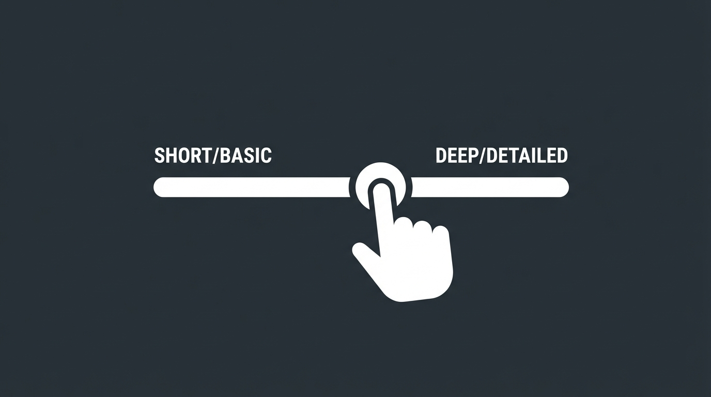

IPA（情報処理推進機構）の試験シラバスや、数百ページある技術書。
**「読むだけで眠くなる」「文字ばかりで頭に入らない」** と感じたことはありませんか？

NotebookLMの **「音声オーバービュー（Audio Overview）」** 機能を使えば、これらを **「AI二人が解説してくれるポッドキャスト」** に一瞬で変換できます。
通勤・通学中や家事の合間など、 **「耳学（みみがく）」** で勉強時間を捻出できる最強のツールです。

しかし、ただPDFを読み込ませてボタンを押すだけでは、ダラダラとした要領を得ない音声になりがちです。
この記事では、生成回数の制限を回避しつつ、 **試験対策に特化した「質の高い教材」** を作るための裏技を紹介します。

## 音声生成の基本と制約

まず、前提として知っておくべきことがあります。

*   **PDFをそのまま読める** : NotebookLMはRAG（検索拡張生成）が得意なため、重たいシラバスPDFも問題なく処理できます。
*   **生成回数の壁** : 無料版では1日の生成回数に制限があります（目安として数回程度）。
    「とりあえず作ってみて、気に入らなかったらやり直そう」を繰り返すと、すぐに制限がかかってしまいます。

だからこそ、 **「一発で成功させるプロンプトと設定」** が重要になります。

## 成功率を高める3つのハック術

シラバス全体を漠然と解説させるのではなく、以下の方法で「意図した教材」を作りましょう。

### 1. メモ機能でソースを絞る（おすすめ！）

シラバス全体を読み込ませた状態で音声化すると、AIはどこを重要視すべきか迷い、浅く広い解説になりがちです。
そこで、NotebookLM内のメモ機能を活用して、ソースを限定します。

**手順:**
1.  チャット欄で **「ストラテジ系の頻出用語をリストアップして」** と指示。
2.  出力された回答を「メモに保存」する。
3.  左側のソース一覧で、 **シラバスのチェックを外し、保存した「メモ」だけにチェックを入れる** 。
4.  その状態で「音声オーバービュー」を生成する。

こうすることで、 **「苦手な分野だけを深掘りしたポッドキャスト」** が完成します。
2進数や計算式などの音声に向かない分野を排除できる点もメリットです。

### 2. 生成AIで「台本」を作らせる

NotebookLMに要約させるのではなく、GeminiやChatGPTで作った「完璧な台本」を読ませる方法です。
一手間かかりますが、クオリティは段違いになります。

**手順:**
1.  Gemini等に指示: 「基本情報技術者試験のセキュリティ攻撃手法について、初心者にもわかりやすく解説するラジオ番組の台本を書いて」
2.  出力されたテキストをコピーし、NotebookLMに「新しいソース（テキスト）」として貼り付け。
3.  そのテキストリソースのみを選択して音声化。

これなら、プロンプトの調整に試行錯誤して生成回数を消費することなく、**狙い通りの解説** を確実に手に入れられます。

### 3. 「カスタマイズ」で長さを調整する

音声生成画面にある「カスタマイズ」ボタン（旧プロンプト入力欄）で、AIに明確な指示を出しましょう。
分数を直接指定することはできませんが、キーワードでコントロール可能です。

*   **サクッと聞きたい時（5分程度）**
    *   `Focus on the absolute basics. Keep it short and concise.`
    *   「最重要ポイントに絞って、簡潔にまとめて」
*   **じっくり学びたい時（15分以上）**
    *   `Deep dive into the details. Use specific examples.`
    *   「詳細まで深掘りして。具体的な事例（たとえ話）を交えて詳しく議論して」

## まとめ

NotebookLMの音声機能は、シラバスという「無機質なデータ」を、**「親しみやすい学習パートナー」** に変える魔法のようなツールです。

1.  **ソースを絞る** : 「メモ」機能で苦手分野だけを抽出。
2.  **台本を作る** : Gemini等と組み合わせて一発成功を狙う。
3.  **指示を出す** : Short / Deep Dive で長さを調整。

通勤電車が、あなただけの「予備校」に変わります。ぜひ試してみてください。